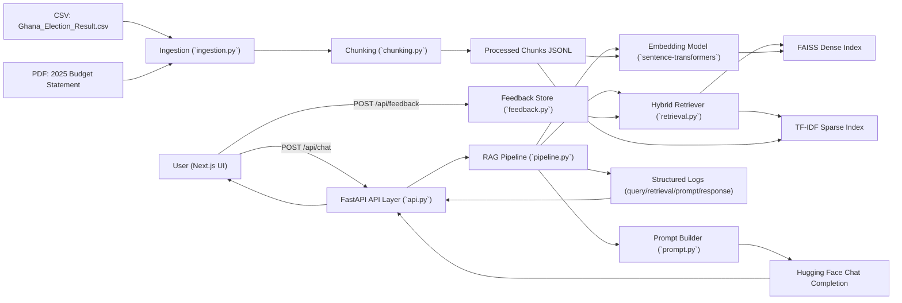

# Part F - Architecture Diagram and Explanation

## System Architecture

## Explanation

1. The frontend sends a query to `POST /api/chat`.
2. The pipeline embeds the query and runs hybrid retrieval:
   - Dense semantic search via FAISS (cosine-equivalent Inner Product on normalized vectors).
   - Sparse lexical search via TF-IDF.
   - Weighted fusion of dense and sparse scores.
3. Retrieved chunks are filtered by minimum dense similarity to mitigate weak retrieval.
4. Prompt construction injects only selected context chunks within a character budget.
5. The final prompt is sent to Hugging Face chat completion for answer generation.
6. The API returns:
   - `answer`
   - `chunks` (with rank and similarity)
   - `finalPrompt`
   - `logs` for transparency.
7. Innovation path: users can submit explicit feedback (`POST /api/feedback`) that adjusts future ranking through a bounded feedback boost.

## Transparency Properties

- No LangChain/LlamaIndex abstractions are used.
- Intermediate artifacts are inspectable:
  - `backend/data/processed/chunks.jsonl`
  - `backend/store/faiss.index`
  - `backend/store/tfidf_matrix.npz`
  - `backend/store/manifest.json`
  - `backend/store/feedback.jsonl`
- Per-request logs include retrieval evidence and prompt text for auditability.

